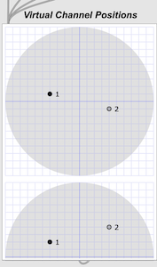

# spatialization-max
## A Max/MSP patch for controlling multiple audio channel gains and reverb across multiple speakers.

This patch handles 16 virtual channels over which soundfile "/play" commands are presented. The /play commands include a channel number, soundfile path, and a loop indicator. Each channel can play any number of soundfiles, one at a time. 

The patch also takes "/position" commands which include a channel number and (x,y,z) coordinates in virtual sound space. The patch takes care of setting gain and reverb for each speaker in the system (currently up to 16) according to the sounds' geometric distance from each speaker. Arbitrary speaker configurations for up to 16 speakers are possible, expressed in JSON. The patch was designed for the 16 speaker CLEAT (Chicago Laboratory for Electro-Acoustic Theater) system, set up by Stephan Moore and colleagues at [Elastic Arts](https://elasticarts.org) in Chicago, but includes examples and settings for a variety of 4-channel and binaural confifgurations. Virtual sources and number of speakers are independent. The fact that we use 16 virtual channels and 16 speakers is mainly coincidence. Increasing either of these could be readily achieved by customizing the patch. Using fewer of either would require no customization, except perhaps by creating a new JSON file for a different speaker geometry if needed. 

The main patch is "Virt16SF-reverb.maxpat". Subpatches, JSON speaker config files, sample sounds, and a Javascript program for computing gains are included in the distribution. This particular patch is for spatializing sound files, but companion patches for spatializing oscillator and audio-in signal banks are also in development. 

## OSC Control

The patch receives the /play and /position commands as OSC messages through a UDP port. This is useful for 
controlling play events and spatial animation from external software (e.g. Unity). However, the patch could 
just as easily be fed these commands from other Max patches, using send/receive. It is also possible to 
send /play commands and manipulate sound positions manually in the patch. Example are invoked on initial load. 

## Speaker Configurations

The number of speakers and their spatial positions are configured in a JSON file and loaded into a dict for speaker 
gain and reverb calculations, for each sound source, whenever a new /position is presented. Speaker configurations 
for 16-chan, binaural, and various 4-chan geometries are included. The overall speaker space is -1 <= x,y <= +1; 0 <= z <= 1.

## Speaker Rolloff Parameter

The gain on each speaker for each virtual channel is a function of its distance from that speaker and a 
"rolloff" parameter. A Gaussian function is used to compute each speaker gain rolloff. This allows for 
smooth panning across speakers.This rolloff parameter sets the "variance" of the Gaussian curve and can be
set to accomplish a continuum of signal isolation or spread across the speakers.

    gaini = e^^(-distancei^^2 / (2 * rolloff))

## Reverb Parameters

A Sigmoid function is used as the activation function for reverb, applied to each virtual channel 
per speaker. This allows for a continuum of fairly abrupt to gradual application of reverb at desired 
distance thresholds. 

### C1
The shape of the Sigmoid curve is controlled by the "c1" parameter. A c1 value of .25 is gradual, 
a value of 2.0 is fairly steep.

### C2
The distance value at which the function reaches its halfway point (.5) is controlled by this 
parameter. 

    reverb_rolloff = 1/(1 + e^^(-c1 *(distance - c2)))

### Wetness
The overall amount of reverb relative to the original "dry" source signal is controlled by this parameter (0.0-1.0).

    reverb_gain = gain * reverb_rolloff * wetness

### Reverberation Time
The reverberation time is controlled by this parameter, revtime, the reverb delay in milliseconds. 
This is multiplied by the reverb sigmoid for sound source distance from (0, 0, 0). That is, the reverb 
delay is not computed  per speaker, but for distance of the sound source from the origin of virtual playback space.

## Dependencies

This patch uses the "ambimonitor" object from the ICST Ambisonics Package. This is used for display and 
manual manipulation of sound source positions in (x, y, z) virtual space. The patch originally used the ICST 
Ambisonic encoder and decoder for source / speaker decoupling. Although it now achieves its own decoupling, 
computing its own gains without the Ambisonic encoder/decoder, we use the ambimonitor for displaying and manually
manipulating sound source positions. It's very handy.

## Getting Started Example

The main patch invokes 2 "/play" and 2 "/position" commands when started. These demonstrate positioning and playback on 2 virtual channels. The channel positions are initially (-0.4, 0.1, 0.2) and (0.4, -0.1, 0.4). These are plotted in the "ambimonitor" under "Virtual Channel Positions". These positions can be moved manually by selecting and dragging them in the ambimonitor. The loudness of each channel is also depending on their proximity to any speakers in the selected speaker 
configuration. Different speaker configurations for binaural, 4-channel, and 16-channel are available at the lower left 
of the main patch. Binaural is automatically selected on patch loading. 

There is also a "Main Gain" control at the upper right of the patch. It is initially set to -6.0 dB. Adjust as needed.

